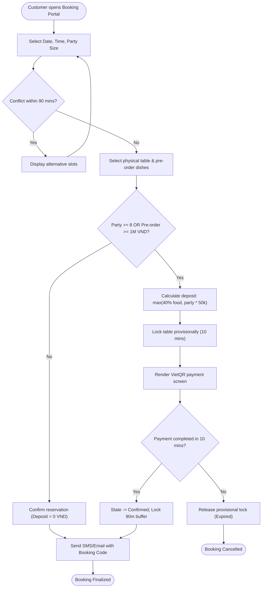
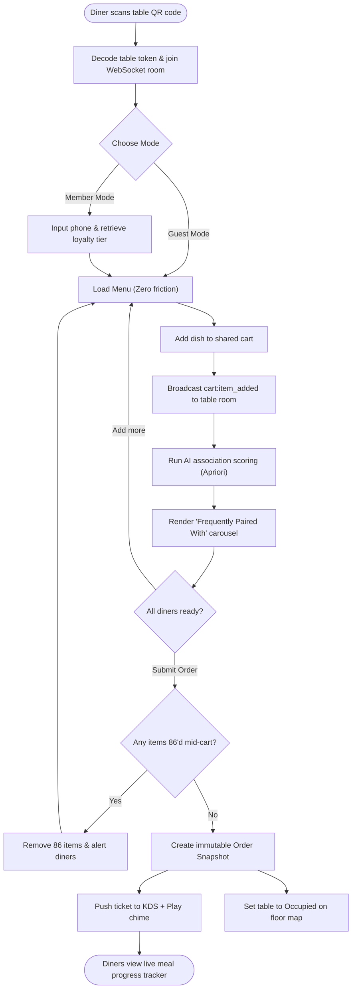
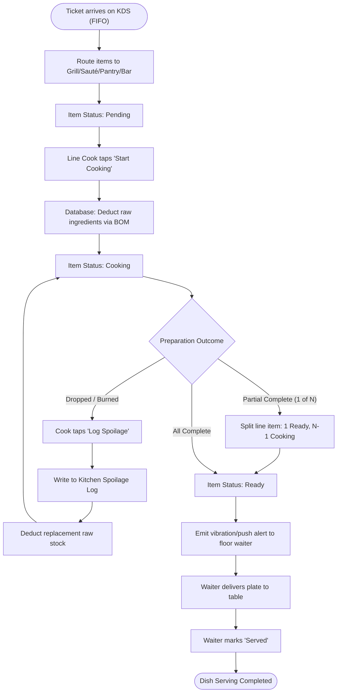
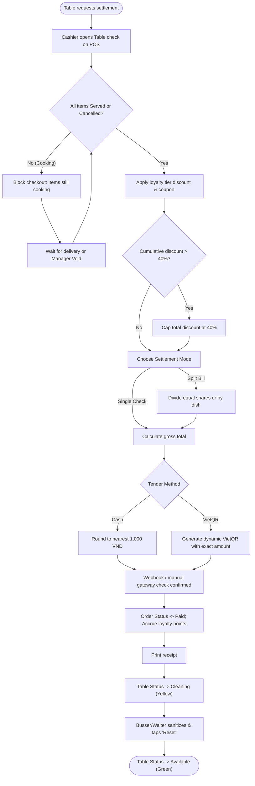
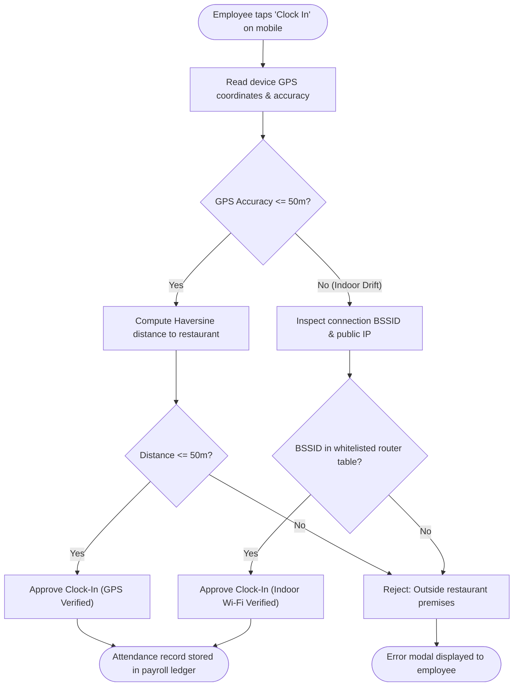

# 4.1 USER FLOW DESIGN: OPERLY
## RESTAURANT OPERATIONS AND PROFITABILITY MANAGEMENT

* **Document:** System User Flows & Interaction Paths
* **Module:** Chapter 4 – Product Design & Prototyping (Section 4.1)
* **Status:** Finalized (Awaiting Review)
* **Traceability Baseline:** PRD v1.1 (`docs/chapter3/product-requirements.md`), User Stories (`docs/chapter3/user-stories.md`), Feature Specification (`docs/chapter3/feature-specification.md`)

---

## 1. Purpose of User Flow Design

The purpose of this User Flow document is to formalize and map the sequential pathways, decision nodes, and system state transitions across all 6 primary actors in **Operly**. 

By defining end-to-end user journeys before UI construction, this document ensures:
* **Frictionless Interaction:** Minimized touchpoints for high-speed restaurant tasks (e.g., $< 4$ clicks for cashier settlement, zero-click table socket synchronization).
* **Fault Tolerance:** Explicit coverage of operational edge cases (e.g., reservation cancellations, mid-order 86 out-of-stock events, Wi-Fi drops, indoor GPS drift).
* **Cross-Role Synchronicity:** Clear synchronization points between Front-of-House (FOH), Back-of-House (BOH), and Management via real-time WebSocket state mutations.
* **Traceability:** Direct verification that every flow implements the requirements established in PRD v1.1.

---

## 2. Primary Actors

The system operates around 6 distinct actors with role-based privileges:

| Actor | Device Environment | Primary Role & Operational Scope |
| :--- | :--- | :--- |
| **Customer** | Mobile Web / Smartphone Browser | Self-orders via on-table QR (Guest Mode or Member Mode); reserves tables online with deposit payment; tracks live preparation status. |
| **Waiter** | Handheld Smartphone (PWA / Responsive) | Monitors real-time floor topology; receives vibrational dish-ready alerts; takes assisted orders; resets cleaned tables. |
| **Kitchen Staff** | Wall/Station Mounted Tablet (KDS) | Manages FIFO prep queue; routes items by station; updates dish cooking progress; logs ingredient spoilage; triggers 86 out-of-stock flags. |
| **Cashier** | Desktop Terminal / Counter Tablet | Reviews completed dining orders; processes equal/itemized bill splits; applies member discounts; renders dynamic VietQR codes. |
| **Manager** | Desktop / Laptop Portal | Configures menus and recipe BOMs; manages inventory procurement; builds weekly staff rosters; analyzes 7-day AI demand forecasts. |
| **Administrator** | Desktop Administration Console | Controls RBAC permission bindings; suspends accounts with instant session invalidation; inspects immutable system audit logs. |

---

## 3. Major User Journeys

```
+---------------------------------------------------------------------------------------------------+
|                                  OPERLY CORE USER JOURNEYS                                        |
+------------------------------------+--------------------------------------------------------------+
| Journey 1: Customer Booking        | Online Reservation -> Capacity Buffer Check -> Advance Cọc   |
| Journey 2: Contactless Dining      | Table QR Scan -> Guest/Member Mode -> Shared Cart -> AI Pair |
| Journey 3: Kitchen Fulfillment     | KDS Chronological Queue -> Station Routing -> Cook & Spoilage|
| Journey 4: Floor Service & Pickup  | Ready Push Notification -> Table Delivery -> Table Bus Reset |
| Journey 5: Checkout Settlement     | POS Check Retrieve -> Member Tier / Split Bill -> VietQR Paid|
| Journey 6: Management & AI Demand  | Recipe BOM Config -> Inventory Alerts -> Shift Geofence -> AI|
| Journey 7: Governance & Security   | Account Provisioning -> Instant Session Revoke -> Audit Logs |
+------------------------------------+--------------------------------------------------------------+
```

---

## 4. Detailed Step-by-Step User Flows

### 4.1. Journey 1: Customer Online Reservation with Advance Deposit
* **Primary Actor:** Customer
* **Trigger:** Customer accesses the restaurant’s web reservation page.
* **Pre-conditions:** System has active table layouts and operational hours configured.
* **Steps:**
  1. Customer selects Party Size, Date, and Time Slot.
  2. System queries active reservations and applies the 90-minute operational conflict buffer:
     $$|T_{\text{existing}} - T_{\text{requested}}| < 90\text{ minutes}$$
  3. System renders available physical tables matching party capacity. Customer picks a table.
  4. Customer optionally browses the pre-order menu and adds items to the booking cart.
  5. System evaluates deposit mandate rule:
     $$\text{Deposit Required} = \begin{cases} 
     \text{None (0 VND)} & \text{if } \text{partySize} < 8 \text{ and } \text{preOrderTotal} < 1,000,000\text{ VND} \\
     \max(0.40 \times \text{preOrderTotal}, \text{partySize} \times 50,000) & \text{otherwise}
     \end{cases}$$
  6. If deposit is 0 VND, reservation transitions directly to `Confirmed`.
  7. If deposit is required, system locks the table in `Provisionally Locked` state for 10 minutes and redirects to the Payment Gateway (VietQR/Sandbox).
  8. Customer completes the transfer; payment gateway issues a server-side webhook.
  9. System verifies transaction, marks reservation as `Confirmed`, locks the 90-minute table window, and sends an SMS/Email with a unique Booking Code.

### 4.2. Journey 2: Dine-In QR Ordering & Multi-Diner Live Cart Sync
* **Primary Actors:** Customer (Guest A & Guest B), Floor Waiter
* **Trigger:** Customers sit at physical Table 05 and scan the table QR code.
* **Pre-conditions:** Table 05 is in `Available` state.
* **Steps:**
  1. Guest A scans QR; application loads in **Guest Mode** (ephemeral table session tied to cryptographic table token). No login prompt is presented.
  2. Guest A joins WebSocket room `table:TBL-05`. Table status changes to `Occupied` on floor screens.
  3. Guest B scans the same QR code and joins room `table:TBL-05`.
  4. Guest A adds 1 "Seafood Spicy Hotpot" with modifier "Less Spicy" to the cart.
  5. System broadcasts `cart:item_added` over WebSocket; Guest B's cart view updates in $< 1$ second.
  6. System triggers the AI Recommender engine (Apriori co-occurrence scoring). Cart view displays a "Frequently Paired With" carousel with 3 complementary items (e.g., "US Beef Slices", "Herbal Tea").
  7. Guest B taps "Add US Beef Slices". Both screens update.
  8. Guest A clicks "Submit Order".
  9. System generates an immutable Order Snapshot (locking prices), issues ticket to KDS, sounds a 500ms 70dB chime in the kitchen, and renders a live visual progress bar on both guests' phones (`Pending` state).

### 4.3. Journey 3: Kitchen Display System (KDS) & Spoilage Workflow
* **Primary Actor:** Kitchen Staff (Line Cook / Head Chef)
* **Trigger:** Order ticket arrives in KDS queue.
* **Pre-conditions:** Order is confirmed by guest or waiter.
* **Steps:**
  1. KDS renders ticket at the end of the chronological FIFO queue, styled with high-contrast typography and station tags (Grill, Hot Line, Pantry, Bar).
  2. Line Cook taps item to transition state from `Pending` $\rightarrow$ `Cooking`.
  3. System triggers transactional database depletion: ingredient quantities are decremented from inventory according to recipe BOM.
  4. Customer meal progress bar updates to `Cooking`.
  5. *Partial Bump Handling:* If quantity is 2 and 1 is ready, cook taps "Bump 1/2". System splits the line item: 1 item transitions to `Ready`, 1 remains `Cooking`.
  6. Once marked `Ready`, system broadcasts push notification and vibration alert to the assigned floor waiter.
  7. *Spoilage Handling:* If an item is dropped or overcooked during prep, cook taps "Log Spoilage". Cook selects reason (Dropped, Overcooked, Expired). System writes to Kitchen Spoilage Log, decrements additional raw stock for the re-fire, and keeps the ticket active on the KDS without charging the customer.

### 4.4. Journey 4: Waiter Floor Operations & Table Reset
* **Primary Actor:** Waiter
* **Trigger:** Push alert arrives or waiter reviews live floor map.
* **Pre-conditions:** Waiter is authenticated on handheld device.
* **Steps:**
  1. Waiter receives alert: *"Table 05: Seafood Hotpot is Ready at Station 3"*.
  2. Waiter picks up plate from kitchen pass and delivers to Table 05.
  3. Waiter taps "Mark Served" on handheld app. Customer progress bar updates to `Served`.
  4. If walk-in tech-averse guests arrive at Table 12, waiter opens Table 12 on floor map, inputs dishes with custom modifiers on their behalf, and submits order.
  5. Once guests finish dining and cashier completes settlement, table turns yellow (`Cleaning`).
  6. Busser/Waiter sanitizes the physical table and taps "Table Cleaned & Reset". Table transitions back to green (`Available`).

### 4.5. Journey 5: Cashier POS Settlement & Split-Billing
* **Primary Actor:** Cashier
* **Trigger:** Customer requests bill or cashier selects table in payment queue.
* **Pre-conditions:** All items for the table are in `Served` or `Cancelled/Spoiled` state.
* **Steps:**
  1. Cashier taps Table 08 in the POS checkout queue.
  2. System verifies payment gate: no line items remain in `Pending` or `Cooking`.
  3. Cashier asks for customer phone number:
     * If member exists: system displays tier (e.g., Gold - 10% off).
     * If customer provides a coupon code: system calculates combined discount, enforcing the cumulative cap of $\le 40\%$.
     * Loyalty points can be redeemed up to a maximum of $30\%$ of the net bill.
  4. *Split Bill Option:* If guests request equal split among 3 people:
     * System creates 3 sub-bills.
     * Guest 1 pays Cash: system applies cash rounding to nearest 1,000 VND.
     * Guest 2 pays VietQR: system renders dynamic VietQR code pre-populated with exact VND amount.
     * Guest 3 pays VietQR: system renders second dynamic VietQR code.
  5. Cashier confirms all sub-bills are settled. Order transitions to `Paid`.
  6. Table transitions to `Cleaning`, receipt prints, and loyalty points credit to the customer profile.

### 4.6. Journey 6: Manager Operations, BOM Setup & AI Forecasting
* **Primary Actor:** Manager
* **Trigger:** Daily management routines, procurement, or scheduling.
* **Pre-conditions:** Manager holds verified credentials.
* **Steps:**
  1. Manager logs into desktop dashboard.
  2. *Menu & BOM Setup:* Manager creates "Grilled Ribeye", attaches photo, sets price (250,000 VND), and specifies recipe BOM (300g Ribeye, 50g Garlic Butter, 100g Asparagus).
  3. *Inventory Alerts:* Dashboard displays low-stock warning for "Ribeye Beef" (Current: 2.1 kg, Safety Threshold: 5.0 kg). Manager generates and approves purchase receiving order.
  4. *Rostering & Attendance:* Manager builds weekly shift schedule. Waiter clocks in; system runs Haversine formula against restaurant coordinates ($16.0544, 108.2022$, radius $\le 50\text{m}$). If GPS horizontal accuracy $> 50\text{m}$, system validates local Wi-Fi BSSID.
  5. *AI BI Dashboard:* Manager opens AI Forecast tab. System executes 7-day time-series inference (ARIMA/Prophet baseline) in $< 500\text{ ms}$, rendering projected daily revenue, expected customer covers, and estimated ingredient prep requirements with $95\%$ confidence interval bands.

### 4.7. Journey 7: System Administrator Governance & Audit
* **Primary Actor:** Administrator
* **Trigger:** Staff onboarding, termination, or security audit.
* **Pre-conditions:** Admin holds superuser privileges.
* **Steps:**
  1. Admin opens Admin Console.
  2. *Account Provisioning:* Admin creates employee profile, assigns role (`Waiter`), and issues temporary credentials.
  3. *Instant Session Revocation:* When an employee is suspended, Admin toggles account to `Suspended`. System increments the user's database `token_version`. On the user's next API request, auth middleware detects token version mismatch and rejects request with `401 Unauthorized`.
  4. *Audit Trail Inspection:* Admin opens read-only `AuditLogs` viewer to inspect high-risk operations (bill voids, price overrides, inventory balance adjustments), filtering by actor ID, date range, or client IP address.

---

## 5. Alternative Flows and Exception Flows

### 5.1. Alternative Flows (AF)
* **AF-1.1: Walk-in Dining without Reservation:**
  * Guest walks in $\rightarrow$ Waiter checks floor map $\rightarrow$ Taps green `Available` table $\rightarrow$ Seats guests and hands QR code or takes direct order on handheld terminal.
* **AF-2.1: Dine-In Guest Links Loyalty Account:**
  * In Guest Mode cart, customer enters phone number $\rightarrow$ System verifies registered profile $\rightarrow$ Converts session to authenticated member $\rightarrow$ Displays available point balance and applies tier discount without resetting cart.
* **AF-3.1: Table Merging for Large Walk-In Groups:**
  * Waiter selects Table 01 $\rightarrow$ Taps "Merge Table" $\rightarrow$ Selects Table 02 $\rightarrow$ System unifies both tables under a single master order ID, updating both physical table markers to `Occupied (Merged)`.
* **AF-5.1: Itemized Bill Splitting by Dish:**
  * Cashier opens split dialog $\rightarrow$ Selects "Split by Item" $\rightarrow$ Drags Dish A and B to Check 1, Dish C and D to Check 2 $\rightarrow$ Processes separate tenders for each check.

### 5.2. Exception Flows (EF)
* **EF-1.1: Reservation Deposit Payment Timeout:**
  * Customer fails to complete VietQR deposit transfer within 10 minutes $\rightarrow$ Provisional table lock expires $\rightarrow$ Table returns to `Available` pool $\rightarrow$ Booking state marked as `Expired`.
* **EF-1.2: Reservation No-Show at Service Time:**
  * Guest does not arrive within 20 minutes after scheduled time (e.g., 19:20 for 19:00 booking) $\rightarrow$ System flags reservation as `No-Show` $\rightarrow$ Deposit is $100\%$ forfeited $\rightarrow$ Table is automatically released to `Available`.
* **EF-2.1: Dish Ordered is 86'd Mid-Session:**
  * Customer has dish in cart, but Head Chef toggles "86" on KDS $\rightarrow$ WebSocket pushes `menu:item_unavailable` $\rightarrow$ Customer cart displays visual warning: *"Item became unavailable and was removed"* $\rightarrow$ "Submit Order" button disables until cart is valid.
* **EF-2.2: WebSocket Client Network Drop & Reconnect:**
  * Customer phone loses Wi-Fi connection for 30 seconds $\rightarrow$ Client socket initiates exponential backoff reconnect $\rightarrow$ Upon reconnect, client calls `/api/v1/sync/state` $\rightarrow$ Cart and meal progress tracker resynchronize to current server state.
* **EF-3.1: Cashier Checkout Attempt with Unfinished Food:**
  * Cashier attempts to finalize bill while an item is still `Cooking` $\rightarrow$ System dialog blocks settlement: *"Cannot settle bill: 1 item is still cooking"* $\rightarrow$ Cashier must either wait for `Served` or obtain Manager passcode to void the unserved item.
* **EF-4.1: Delayed Payment Gateway Webhook:**
  * Customer completes mobile bank transfer via VietQR but webhook drops $\rightarrow$ POS remains in `Pending Payment` $\rightarrow$ Cashier clicks "Check Gateway Status" $\rightarrow$ System queries payment provider API directly using transaction reference $\rightarrow$ Confirms payment and completes check.
* **EF-6.1: Staff Attendance Indoor GPS Signal Drift:**
  * Staff attempts clock-in from basement prep kitchen; GPS reports horizontal accuracy $\pm 80\text{m}$ ($> 50\text{m}$) $\rightarrow$ System executes fallback: inspects local Wi-Fi router BSSID and client public IP $\rightarrow$ Matches restaurant hardware $\rightarrow$ Clock-in approved with "Wi-Fi Verified" audit tag.

---

## 6. Screen Mapping

The following matrix maps each user flow step to its corresponding user interface screen:

| Screen ID | Screen Name | Actor | Flow Steps Covered |
| :--- | :--- | :--- | :--- |
| **SCR-CUST-01** | Public Landing & Reservation Portal | Customer | Journey 1 (Steps 1–4), AF-1.1 |
| **SCR-CUST-02** | Reservation Deposit & Payment Screen | Customer | Journey 1 (Steps 5–9), EF-1.1 |
| **SCR-CUST-03** | Contactless QR Menu & Live Shared Cart | Customer | Journey 2 (Steps 1–7), AF-2.1, EF-2.1 |
| **SCR-CUST-04** | Live Meal Progress Tracker | Customer | Journey 2 (Step 9), Journey 3 (Step 4) |
| **SCR-WAIT-01** | Real-Time Interactive Floor Map | Waiter | Journey 4 (Step 4), AF-3.1 |
| **SCR-WAIT-02** | Assisted Order Entry & Modifier Sheet | Waiter | Journey 4 (Step 4) |
| **SCR-WAIT-03** | Dish-Ready Notification Drawer | Waiter | Journey 4 (Steps 1–3) |
| **SCR-KDS-01** | Kitchen Display FIFO Queue Station | Kitchen | Journey 3 (Steps 1–5) |
| **SCR-KDS-02** | 86 Out-of-Stock Management Modal | Kitchen | Journey 3 (Step 6), EF-2.1 |
| **SCR-KDS-03** | Kitchen Spoilage / Wastage Logger | Kitchen | Journey 3 (Step 7) |
| **SCR-POS-01** | POS Billing Overview & Checkout Queue | Cashier | Journey 5 (Steps 1–2), EF-3.1 |
| **SCR-POS-02** | Split-Billing & Loyalty Discount Modal | Cashier | Journey 5 (Steps 3–4), AF-5.1 |
| **SCR-POS-03** | Dynamic VietQR Payment Terminal | Cashier | Journey 5 (Steps 4–6), EF-4.1 |
| **SCR-MGR-01** | Executive Dashboard & AI Forecast View | Manager | Journey 6 (Step 5) |
| **SCR-MGR-02** | Menu & Recipe BOM Management | Manager | Journey 6 (Step 2) |
| **SCR-MGR-03** | Inventory Receiving & Low-Stock Alerts | Manager | Journey 6 (Step 3) |
| **SCR-MGR-04** | Weekly Rostering & Attendance Audit | Manager | Journey 6 (Step 4), EF-6.1 |
| **SCR-ADM-01** | Account Provisioning & RBAC Matrix | Admin | Journey 7 (Steps 1–3) |
| **SCR-ADM-02** | Immutable System Audit Logs Viewer | Admin | Journey 7 (Step 4) |

---

## 7. Mermaid Flow Diagrams

### 7.1. Diagram 1: Online Reservation & Tiered Deposit Lifecycle


### 7.2. Diagram 2: Dine-In QR Ordering, Shared Cart & AI Recommender


### 7.3. Diagram 3: Kitchen Display Progression & Spoilage Logging


### 7.4. Diagram 4: Cashier POS Settlement & VietQR Split Billing


### 7.5. Diagram 5: Staff Attendance Geofencing & Wi-Fi Fallback


---

## 8. Traceability to PRD Requirements

This matrix confirms that all functional requirements from PRD v1.1 are implemented across the user flows:

| Requirement ID | Requirement Name | Addressed in User Flow Sections |
| :--- | :--- | :--- |
| **FR-001** | Authentication & RBAC | Section 4.7 (Steps 1–3), Section 2 |
| **FR-002** | Online Reservation & Deposit | Section 4.1 (Steps 1–9), Section 7.1, EF-1.1, EF-1.2 |
| **FR-003** | QR Menu & Multi-Diner Ordering | Section 4.2 (Steps 1–9), Section 7.2 |
| **FR-004** | AI Food Recommender | Section 4.2 (Step 6), Section 7.2 |
| **FR-005** | Real-Time Table Topology | Section 4.4 (Steps 4–6), Section 7.2, Section 7.4 |
| **FR-006** | Kitchen Display System (KDS) | Section 4.3 (Steps 1–6), Section 7.3, EF-2.1 |
| **FR-007** | Real-Time Event Dispatch & Catch-up | Section 4.2 (Step 5), EF-2.2, Section 7.2 |
| **FR-008** | POS Checkout & Settlement | Section 4.5 (Steps 1–6), Section 7.4, AF-5.1, EF-3.1, EF-4.1 |
| **FR-009** | Recipe BOM Depletion & Spoilage | Section 4.3 (Steps 2–3, Step 7), Section 7.3 |
| **FR-010** | Staff Scheduling & Geofenced Attendance | Section 4.6 (Step 4), Section 7.5, EF-6.1 |
| **FR-011** | Tiered Loyalty & Rewards | Section 4.5 (Step 3), AF-2.1 |
| **FR-012** | Business Intelligence & AI Analytics | Section 4.6 (Step 5) |
| **FR-013** | Kitchen Spoilage & Wastage Tracking | Section 4.3 (Step 7), Section 7.3 |

---
*End of Document: 4.1 User Flow Design.*
